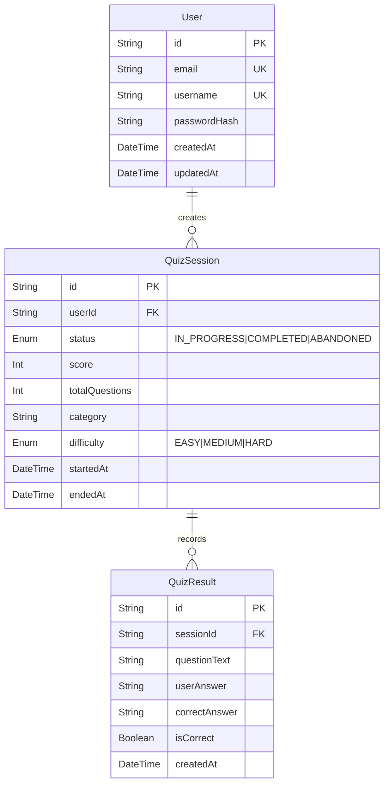

# Database Schema Documentation

This document outlines the initial database schema for the Trivia Game application. The core models required for storing users, active quiz sessions, and the results of individual questions are `User`, `QuizSession`, and `QuizResult`.

The database is powered by **PostgreSQL** and managed using **Prisma ORM**.

## Models

### 1. User

Represents an individual playing the trivia game.

| Field          | Type            | Attributes             | Description                                   |
| -------------- | --------------- | ---------------------- | --------------------------------------------- |
| `id`           | `String`        | `@id @default(uuid())` | Primary key.                                  |
| `email`        | `String`        | `@unique`              | The user's email address.                     |
| `username`     | `String`        | `@unique`              | Visual display name for leaderboards/profile. |
| `passwordHash` | `String?`       | Optional               | Hashed password. Can be null if using OAuth.  |
| `createdAt`    | `DateTime`      | `@default(now())`      | Creation timestamp.                           |
| `updatedAt`    | `DateTime`      | `@updatedAt`           | Automatic update timestamp.                   |
| `sessions`     | `QuizSession[]` | Relation               | One-to-many relationship with `QuizSession`.  |

### 2. QuizSession

Represents an active or completed run of a quiz by a user.

| Field            | Type            | Attributes                   | Description                                             |
| ---------------- | --------------- | ---------------------------- | ------------------------------------------------------- |
| `id`             | `String`        | `@id @default(uuid())`       | Primary key.                                            |
| `userId`         | `String`        | Foreign Key                  | References `User.id`. Indexed, `onDelete: Cascade`.     |
| `status`         | `SessionStatus` | `Enum` default `IN_PROGRESS` | Can be `IN_PROGRESS`, `COMPLETED`, `ABANDONED`.         |
| `score`          | `Int`           | `@default(0)`                | Total accumulated score in this session.                |
| `totalQuestions` | `Int`           |                              | Expected number of questions in the session.            |
| `category`       | `String?`       | Optional                     | The trivia category (e.g., "Science", "History").       |
| `difficulty`     | `Difficulty?`   | `Enum` Optional              | The difficulty level (`EASY`, `MEDIUM`, `HARD`).        |
| `startedAt`      | `DateTime`      | `@default(now())`            | When the session started.                               |
| `endedAt`        | `DateTime?`     | Optional                     | When the session ended.                                 |
| `results`        | `QuizResult[]`  | Relation                     | One-to-many relationship tracking individual questions. |

### 3. QuizResult

Represents the result of a single question answered during a `QuizSession`.

| Field           | Type       | Attributes             | Description                                           |
| --------------- | ---------- | ---------------------- | ----------------------------------------------------- |
| `id`            | `String`   | `@id @default(uuid())` | Primary key.                                          |
| `sessionId`     | `String`   | Foreign Key            | References `QuizSession.id`. Indexed, `onDelete: Cascade`. |
| `questionText`  | `String`   |                        | The text of the question asked.                       |
| `userAnswer`    | `String?`  | Optional               | The answer provided by the user.                      |
| `correctAnswer` | `String`   |                        | The correct answer for the question.                  |
| `isCorrect`     | `Boolean`  |                        | Whether the `userAnswer` matched the `correctAnswer`. |
| `createdAt`     | `DateTime` | `@default(now())`      | When the answer was submitted.                        |

## Enums

- **SessionStatus**: `IN_PROGRESS`, `COMPLETED`, `ABANDONED`
- **Difficulty**: `EASY`, `MEDIUM`, `HARD`

## Entity-Relationship Diagram

